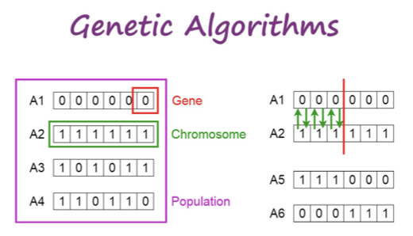
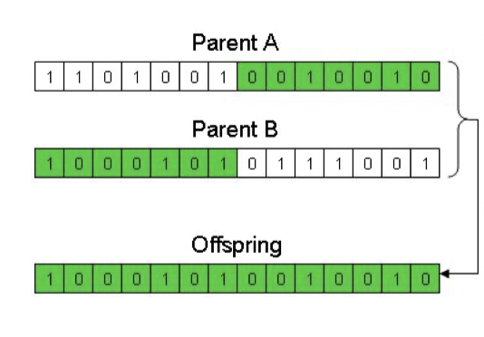
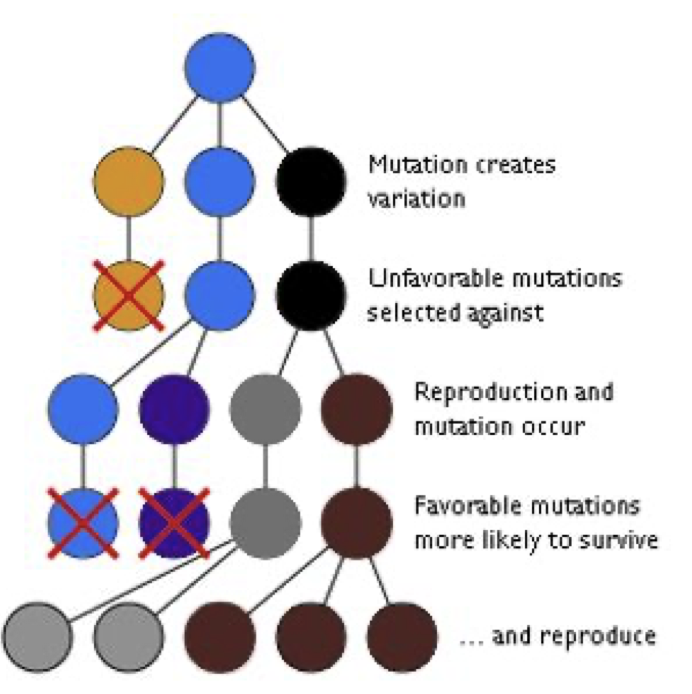
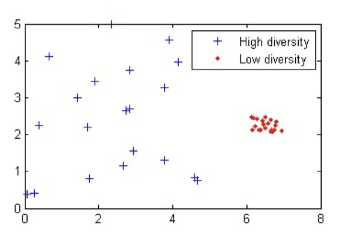
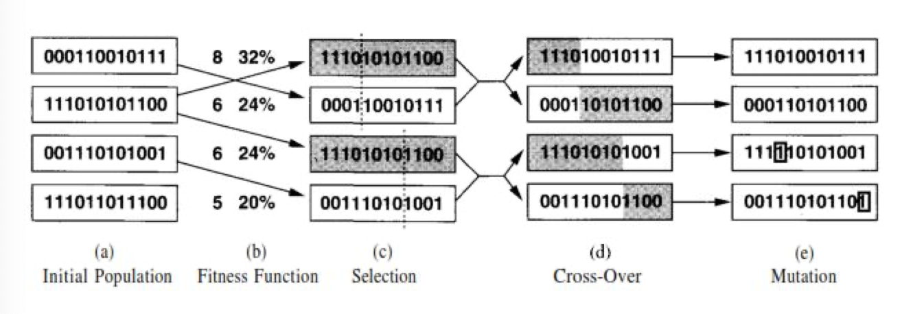
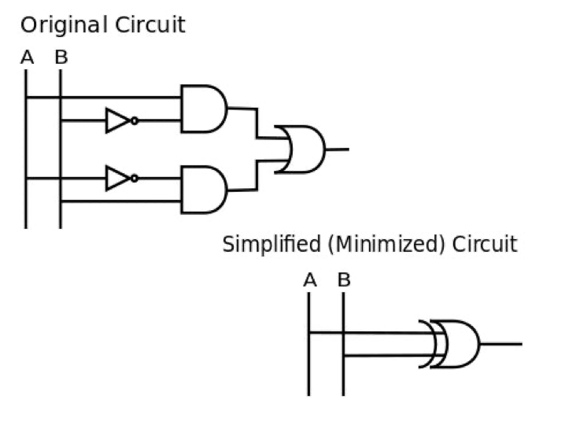
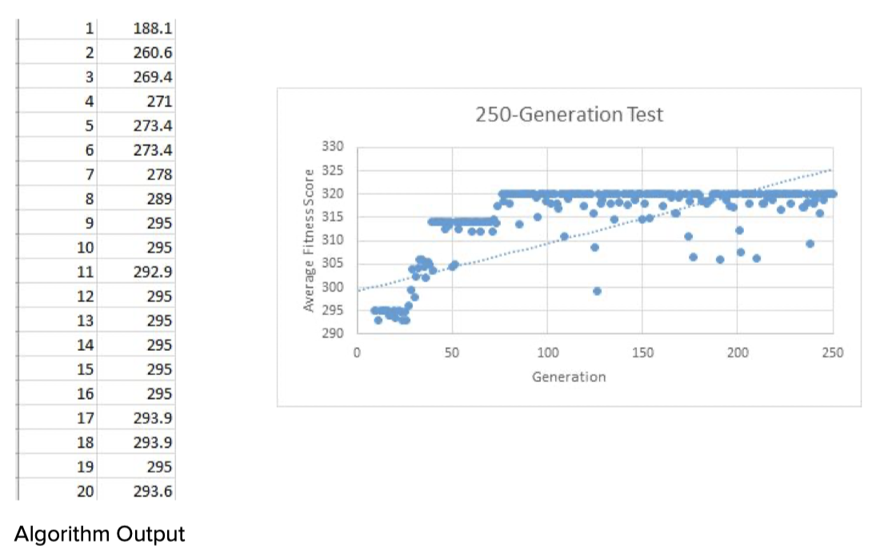
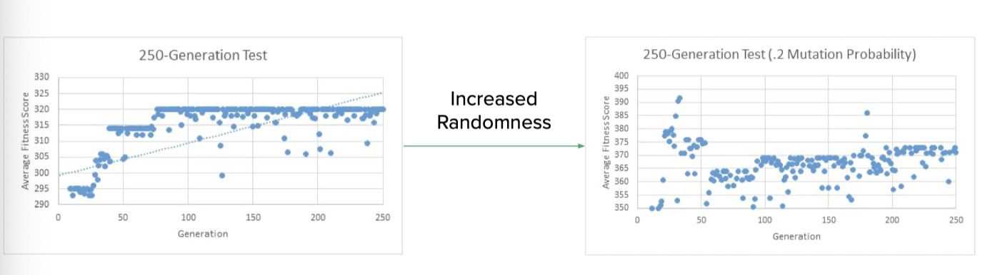
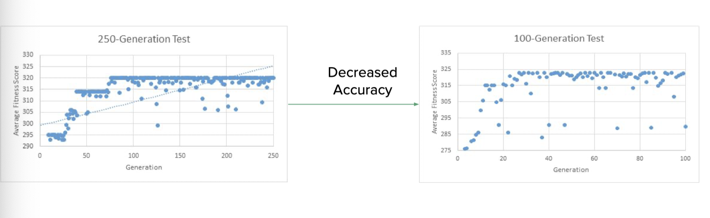

# Evolutionary Algorithms

Liam Brew, Walter Magiera, Jocelyn Ragukonis | May 2019

---

Evolutionary algorithms, optimization methods developed during the 1960s, are inspired by evolutionary theory, specifically Darwin's theory of evolution. They are primarily based on three similar research fields: genetic algorithms, evolutionary programming, and evolution strategies. 

## Genetic Algorithms

- Introduced by John Holland in 1960
- Inspired by natural selection principles
- Used to solve optimization problems
- Uses genetic operators, including mutation, selection, and crossover
- Beneficial in situations where optimization is non-linear

---

## Evolutionary Programming

- Developed by Lawrence Fogel in 1960
- Another method to solve optimization problems
- Primarily relies on mutation as its primary genetic operator
- Puts more significance on the behavior of both the parent and the offspring 

---

## Evolution Strategies

- Developed by Hans-Paul Schwefel and Ingo Rechenberg in the early 1960s

- A method to solve optimization problems

- Relies on genetic operators, including mutation and selection 

- Two different strategies were developed

  - Plus Strategy: the parent is considered
  - Comma Strategy: the parent generation dies off and is not considered

  ---

  ## Darwin's Theory of Evolution 

- Survival of the fittest

- Natural selection 

- Survival and reproduction 

---

## Model Derivation 

- Darwin's theory of evolution 
- Gene selection theory 
- Random mutation for diversity

---

## Model Structure

### Overview

- Evolutionary algorithms simulate the survival and breeding of the best specimens of a population

- A specimen’s Fitness Score is determined by applying a customized fitness function

  - The Fitness Score is the summation of all an individual’s positive and negative attributes
  - The higher the score of an individual the more fit it is to survive and reproduce

  ### Reproduction

- Only the most fit individuals are able to reproduce; the rest die off

- Positive traits are passed down to these individual’s offspring

  - Lead to each generation having an overall higher Fitness Score than its parents’ generation 
  - Random mutations are present to ensure diversity and explore additional options

- Over time these positive traits that survive become commonplace in generations, as opposed to their former top position

  - A recursive sequence of optimizations leads to the overall most efficient design

  ### Gene Selection Theory 

- Limited environmental carrying capacity

- Certain genes are better than others

- Genes compete for survival

  - Superior genes are passed down to new generations, resulting in an evolution
  - Inferior genes die off when their host individuals fail to reproduce

-  Mutation allows diversity in a system, creating better and stronger genes

### Model Structure

## Applications

### Finance

- Help determine asset allocation 

- Optimize portfolio investment strategies

  - Slightest improvement = millions of dollars

- Fitness score accounts for risk, profit, and margins

  - Results in optimized and balanced investment strategies
  - Can be modified to favor one attribute over the other

  ### Engineering

- Optimizes a system by removing unnecessary components

  - Fitness score determines a component's overall importance to the system
    - A low fitness score identifies a component that can be removed with little impact
    - A high fitness score shows critical areas which R&D should focus on

- The more optimized a system, the better its performance

  - Also easier and cheaper to design, manufacture, and improve minimalistic systems

  

  ## Model Overview

  

Optimize the function
$$
y = w_1x_1+w_2x_2+w_3x_3+w_4x_4+w_5x_5+w_6x_6
$$

- 6 inputs and 6 weights for each input
- Obtain the largest value for $y$ 

## The Knapsack Problem 

- Common combinatorial optimization problem in computer science
- Goal of the problem
  - Given a certain number of items with weight and value
  - How many of each item to include in a collection 
  - The total weight is less than or equal to a set limit

## The Model 

- 130-line Python script that randomly generates a sample gene population
- Each gene is assigned a unique permutation ID as well as fitness and weight scores
- Genes then breed with each other with random mutation taking place throughout
- Number of generations determines amount of times breeding takes place
- Each generation’s averaged fitness score is outputted as a .csv file which is then graphed in Excel

### Results

### Mutation Manipulation

### Sample Size Manipulation

## Conclusion 

- *“Survival of the Fittest”*
  - User directly determines what qualifies as “the fittest” 
  - Series of optimizations result in the most efficient end product possible
  - Inferior solutions are culled
- Can be tailored to fit an individual problem or situation
